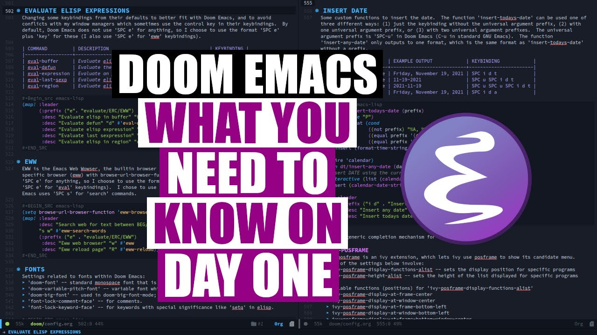

# The-Guidebook-Of-Doom-Emacs

> English | [中文](README-CN.md)

## Configuration (SPC f p)
- .doom.d/init.el
This file controls what Doom modules are enabled and what order they load in. Remember to run 'doom sync' after modifying it!
    
    Press 'SPC h d h' (or 'C-h d h' for non-vim users) to access Doom'sdocumentation.
    
    Move your cursor over a module's name (or its flags) and press 'K' (or 'C-c c k' for non-vim users) to view its documentation. This works on flags as well (those symbols that start with a plus).
    
    K查看
    C-o退出
    
    Alternatively, press 'gd' (or 'C-c c d') on a module to browse its directory (for easy access to its source code).
    
- .doom.d/config.el
Place your private configuration here! Remember, you do not need to run 'doom sync' after modifying this file!